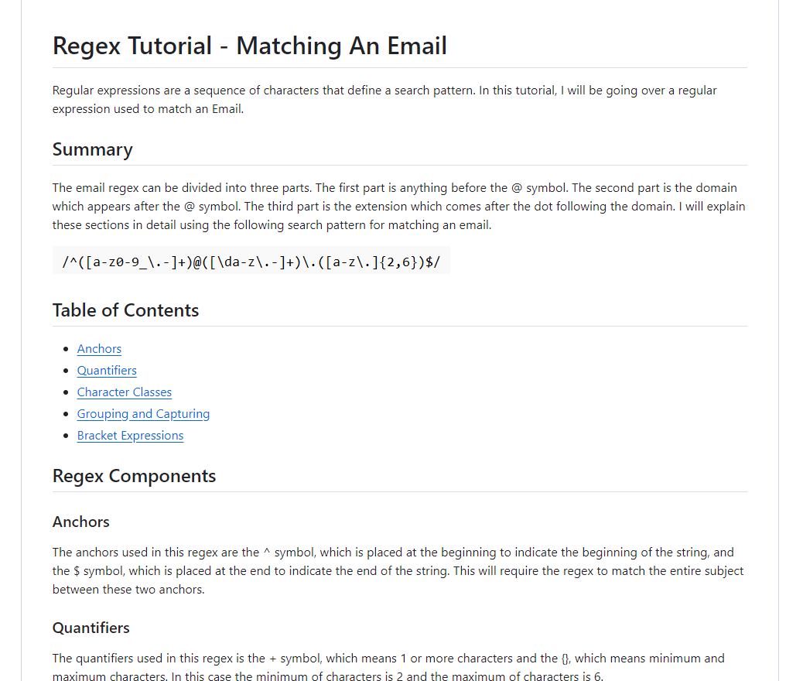

# ComputerScienceJS

## Description
As a web development student, I want a tutorial explaining a specific regex so that I can understand the search pattern the regex defines.

## Usage

When you open the tutorial, you will see a descriptive title and introductory paragraph explaining the purpose of the tutorial, a summary describing the regex featured in the tutorial, a table of contents linking to different sections that break down each component of the regex and explain what it does, and a section about the author with a link to the author’s GitHub profile. When you click on the links in the table of contents, you will be taken to the corresponding sections of the tutorial.  When you read through each section of the tutorial, you will find a detailed explanation of what a specific component of the regex does.  When you reach the end of the tutorial, you will find a section about the author and a link to the author’s GitHub profile.

## Live Site Application
[Link to Live Site]https://gist.github.com/MCalvario/b6b41d5bd035c25f8a4cfcde977b975e 
[Screenshot of application]

## Credits
variables.sh https://www.variables.sh/what-is-regex/#:~:text=Regexes%20are%20composed%20of%20several,classes%2C%20quantifiers%2C%20and%20alternation. 
youtube.com https://www.youtube.com/watch?v=GE-0K0izHVE&t=652s

## license

Copyright (c) [2023] [ComputerScienceJS]

Permission is hereby granted, free of charge, to any person obtaining a copy
of this software and associated documentation files (the "Software"), to deal
in the Software without restriction, including without limitation the rights
to use, copy, modify, merge, publish, distribute, sublicense, and/or sell
copies of the Software, and to permit persons to whom the Software is
furnished to do so, subject to the following conditions:

The above copyright notice and this permission notice shall be included in all
copies or substantial portions of the Software.

THE SOFTWARE IS PROVIDED "AS IS", WITHOUT WARRANTY OF ANY KIND, EXPRESS OR
IMPLIED, INCLUDING BUT NOT LIMITED TO THE WARRANTIES OF MERCHANTABILITY,
FITNESS FOR A PARTICULAR PURPOSE AND NONINFRINGEMENT. IN NO EVENT SHALL THE
AUTHORS OR COPYRIGHT HOLDERS BE LIABLE FOR ANY CLAIM, DAMAGES OR OTHER
LIABILITY, WHETHER IN AN ACTION OF CONTRACT, TORT OR OTHERWISE, ARISING FROM,
OUT OF OR IN CONNECTION WITH THE SOFTWARE OR THE USE OR OTHER DEALINGS IN THE
SOFTWARE.