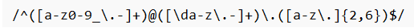

# ComputerScienceJS

Regular expressions are a sequence of characters that define a search pattern.  In this tutorial, I will be going over a regular expression used to match an Email.

## Summary

 The email regex can be divided into three parts.  The first part is anything before the @ symbol.  The second part is the domain which appears after the @ symbol.  The third part is the extension which comes after the dot following the domain. I will explain these sections in detail using the following search pattern to help you find a matching email.  

## Table of Contents

- [Anchors](#anchors)
- [Quantifiers](#quantifiers)
- [Character Classes](#character-classes)
- [Grouping and Capturing](#grouping-and-capturing)
- [Bracket Expressions](#bracket-expressions)
- [Greedy and Lazy Match](#greedy-and-lazy-match)
- [Boundaries](#boundaries)
- [Back-references](#back-references)
- [Look-ahead and Look-behind](#look-ahead-and-look-behind)

## Regex Components

### Anchors

The anchors used in this regex are the ^ symbol, which is placed at the beginning to indicate the beginning of the string, and the $ symbol, which is placed at the end to indicate the end of the string. This will require the regex to match the entire subject between these two anchors.

### Quantifiers
The quantifiers used in this regex is the + symbol, which means 1 or more characters and the {}, which means minimum and maximum characters.  In this case the minimum of characters is 2 and the maximum of characters is 6.

### Character Classes
Character classes are the things that appear in between the square brackets that allow you to define specific sets of characters that can be used in a search pattern.  The character classes used in this regex are \d, which is any digit between 0 and 9.

### Grouping and Capturing

### Bracket Expressions

### Greedy and Lazy Match

### Boundaries

### Back-references

### Look-ahead and Look-behind

## Author

Hello, I'm Maribel Calvario and I am currently a full stack web development student. 

You can view my github at https://github.com/MCalvario
