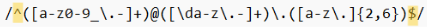
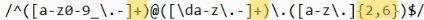

# ComputerScienceJS

In this tutorial, I will be going over a regular expression used to match an Email.

## Summary

A regular expression is a sequence of characters that defines a search pattern. I will be using the example below to explain the email regex in detail.  

## Table of Contents

- [Anchors](#anchors)
- [Quantifiers](#quantifiers)
- [Character Classes](#character-classes)
- [Grouping and Capturing](#grouping-and-capturing)
- [Bracket Expressions](#bracket-expressions)

## Regex Components

### Anchors

The anchors used in this regex are the ^ symbol, which is placed at the beginning to indicate the beginning of the string, and the $ symbol, which is placed at the end to indicate the end of the string. This will require the regex to match the entire subject between these two anchors.  

### Quantifiers
The quantifiers used in this regex are the + symbol, which means 1 or more characters for that section it is being used in, and the curly braces {}, which is used to indicate the minimum number of characters and maximum number of characters for the section it is being used in. In this case the minimum number of characters is 2 and the maximum number of characters is 6.  

### Character Classes
Character classes are the things that appear in between the square brackets that allow you to define specific sets of characters that can be used in a search pattern.

The character classes used in this regex are as follows:
a-z, which means characters between a and z
0-9, which means digits between 0-9
/d, which means any digit between 0-9  

### Grouping and Capturing
The email regex can be divided into three groups that can be captured. To capture these groups, place parenthesis around the specific group you want to capture. Please see the example below. The first group captured is anything in the parenthesis before the @ symbol. The second group captured is the domain which appears in parenthesis after the @ symbol. The third group captured in parenthesis is the extension which comes after the dot following the domain.  

### Bracket Expressions
Brackets define a set of characters to be matched. In this regex, [a-z0-9_.-] is matching a-z, 0-9, and underscore or dot, or dash. In the second set of brackets [\da-z.-], it is matching any digit 0-9, a-z, and a dot or a dash. In the third set of brackets [a-z.], it is matching only a-z and a dot.  

## Author

Hello, I'm Maribel Calvario and I am currently a full stack web development student. 

You can view my github at https://github.com/MCalvario
